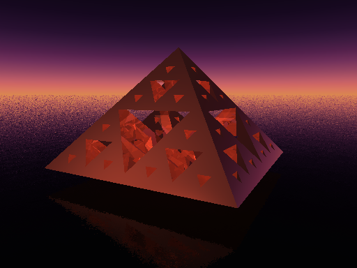

# Realistic-multi-layer-pyramid
This is a Realistic multi-layer pyramid using pov-ray v3.6
## Usage
1. Download pov-ray v3.6
2. Download Realskies Package at [sky_sphere](http://povray.tashcorp.net/library/sky_sphere/) and put it in the inc directory
3. Change the camera, light, texture and the number of the layers as you like
## Demo

